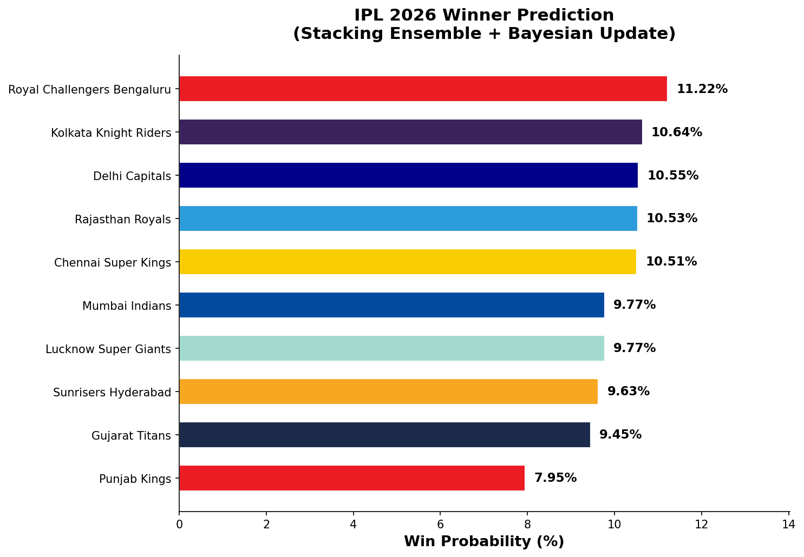
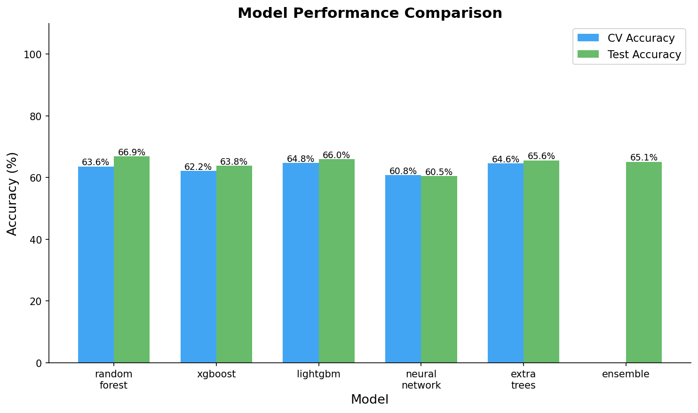
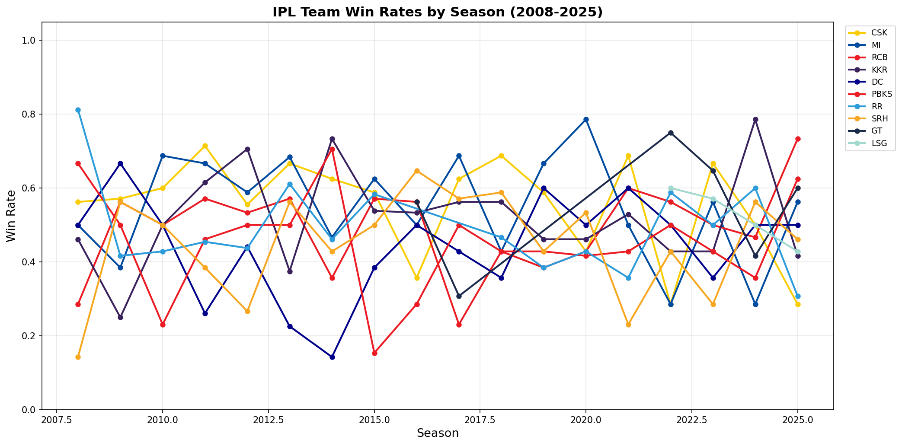

# IPL 2026 Winner Prediction

Machine learning pipeline for predicting IPL 2026 outcomes using historical IPL ball-by-ball data from 2008-2025 and a 2026 fixture list.

This project trains multiple supervised models on match-level features engineered from real IPL history, compares their performance, and produces tournament-level winner probabilities plus result visualizations.

## What This Project Does

- Builds a clean historical training dataset from raw IPL ball-by-ball data
- Engineers match, venue, form, head-to-head, and team-strength features
- Trains multiple models: Random Forest, XGBoost, LightGBM, Neural Network, ExtraTrees, and a stacking ensemble
- Generates 2026 tournament winner probabilities
- Saves evaluation metrics and result charts for reporting

## Project Inputs

This repo expects two separate datasets:

- Historical IPL dataset, 2008-2025
  Downloaded from Kaggle and passed at runtime with `--ipl-csv`
- 2026 fixture file
  Stored in this repo as `ipl-2026-UTC.csv`

The historical training CSV is not committed to the repo.

## Actual Run Snapshot

Model metrics from `outputs/results/model_results.json`:

| Model | CV Accuracy | Test Accuracy | Test AUC |
|------|-------------|---------------|----------|
| Random Forest | 0.6361 | 0.6689 | 0.6993 |
| XGBoost | 0.6217 | 0.6380 | 0.7159 |
| LightGBM | 0.6477 | 0.6600 | 0.7138 |
| Neural Network | 0.6080 | 0.6049 | 0.6141 |
| ExtraTrees | 0.6460 | 0.6556 | 0.7091 |
| Ensemble | - | 0.6512 | 0.7071 |

Current 2026 winner ranking from `outputs/results/prediction_2026.json`:

| Rank | Team | Win Probability |
|------|------|-----------------|
| 1 | Royal Challengers Bengaluru | 11.22% |
| 2 | Kolkata Knight Riders | 10.64% |
| 3 | Delhi Capitals | 10.55% |
| 4 | Rajasthan Royals | 10.53% |
| 5 | Chennai Super Kings | 10.51% |
| 6 | Mumbai Indians | 9.77% |
| 7 | Lucknow Super Giants | 9.77% |
| 8 | Sunrisers Hyderabad | 9.63% |
| 9 | Gujarat Titans | 9.45% |
| 10 | Punjab Kings | 7.95% |

## Repository Structure

```text
ipl-winner-pred-2026/
├── config.py
├── main.py
├── requirements.txt
├── ipl-2026-UTC.csv
├── data/
│   ├── raw/
│   ├── processed/
│   └── db/
├── outputs/
│   ├── models/
│   └── results/
├── src/
│   ├── data/
│   ├── features/
│   ├── models/
│   └── prediction/
└── tests/
```

## Local Setup

This repo uses `uv pip` for package installation.

```bash
uv pip install -r requirements.txt
```

Download the Kaggle historical dataset path:

```bash
python -c "import os, kagglehub; p=kagglehub.dataset_download('chaitu20/ipl-dataset2008-2025'); print(next(os.path.join(p, f) for f in os.listdir(p) if f.endswith('.csv')))"
```

That command prints the absolute path to the historical IPL CSV on your machine.

## CLI Usage

Run setup with the Kaggle dataset:

```bash
python main.py --mode setup --ipl-csv "/absolute/path/to/IPL.csv"
```

Train models:

```bash
python main.py --mode train
```

Generate 2026 predictions:

```bash
python main.py --mode predict --ipl-csv "/absolute/path/to/IPL.csv"
```

Generate charts:

```bash
python main.py --mode visualize
```

Run the full pipeline:

```bash
python main.py --mode all --ipl-csv "/absolute/path/to/IPL.csv"
```

Optional environment-variable workflow:

```bash
export IPL_CSV_PATH="/absolute/path/to/IPL.csv"
python main.py --mode all
```

## Outputs

Generated artifacts are written to `outputs/results/`:

- `prediction_2026.json`
- `model_results.json`
- `win_probability.png`
- `model_comparison.png`
- `historical_win_rates.png`

Trained model binaries are written to `outputs/models/`.

## Visual Results

### 2026 Winner Probabilities



This chart shows the final title probability distribution after combining model predictions with the project’s Bayesian weighting for squad strength, recent form, and playoff history. The top group is tightly packed, which suggests the model sees the 2026 season as relatively open rather than dominated by one team.

### Model Comparison



This comparison summarizes cross-validation and holdout-set performance across the trained models. In this run, Random Forest delivered the best test accuracy, while XGBoost produced the highest test AUC, and the ensemble performed competitively but did not clearly beat the strongest single models on accuracy.

### Historical Win Rates



This plot provides historical context by showing long-run team win patterns from the source IPL data. It helps explain why some teams start with stronger baseline priors before the 2026-specific adjustments are applied.

## Notes

- The root `IPL.csv` file is intentionally not stored in the repo
- Historical data is expected from Kaggle at runtime
- The 2026 fixture file in this repo is used for future-schedule context, not model training

## Tests

```bash
python -m pytest tests -v
```
